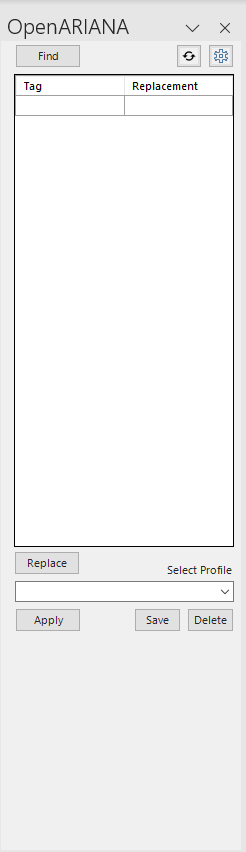

# Profile management & Tag replacement

## What is a profile?

In openARIANA, a Word Add-in, a profile is a set of predefined tag-to-replacement mappings. This feature allows users to efficiently and consistently edit various documents by automating the process of replacing specific tags or phrases. It's particularly useful for repetitive editing tasks, saving time and reducing manual errors.

## Create a profile

To create a profile:
- __Identify Tags:__ Start by using the 'Find' feature to locate all tags in the current document. These tags are typically based on a predetermined pattern set in the application settings (default: `#\w+(\-\w+)*`) 
- __Specify Replacements:__ Once the tags are listed, enter the desired replacements for each tag in the provided table.
- __Save the Profile:__ After setting up the tag-to-replacement mappings, save these as a new profile. Enter a name for this profile in the 'Select Profile' box.
- __Finalize:__ Click 'Save' to store the profile. This profile can now be applied to any document, streamlining the editing process for similar tasks or contexts.

## Apply a profile

To apply a profile:
- __Choose the Profile:__ Open the document you wish to edit and select the desired profile from the dropdown menu in the application’s task pane
- __Apply the Profile:__ Click 'Apply'. The application will automatically load the applicable tag-replacement values in the document based on the mappings defined in the selected profile.
- __Replace Tags:__ Click 'Replace' to replace all tags.
- __Review Changes:__ It’s advisable to review the document to ensure all replacements are correctly applied.

## Update a profile

To update an existing profile:
- __Select the Profile:__ Choose the profile you wish to update from the dropdown menu.
- __Make Modifications:__ Modify the tag-to-replacement mappings as needed. This may involve adding new tags, changing existing replacements, or removing certain mappings.
- __Save Updates:__ After making the changes, save the updated profile. You can either overwrite the existing profile or save the changes as a new profile, depending on your preference. 

_Note: Overwriting a profile will not reset the profile but update the profile, i.e., newly defined tag-replacement pairs are added and modified pairs overwritten._

## Delete a profile

To delete a profile:
- __Select the Profile:__ Choose the profile you wish to delete from the dropdown menu.
- __Delete:__ Click on the 'Delete' button. This action will remove the profile from your list of available profiles.
- __Confirm Deletion:__ You'll be prompted to confirm the deletion. Once confirmed, the profile will be permanently removed.

Note: Always ensure that a profile is no longer needed before deleting it, as this action is irreversible.
