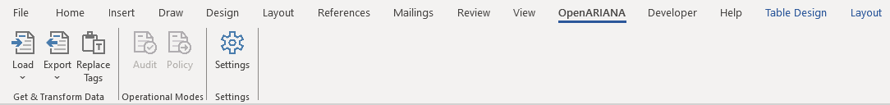
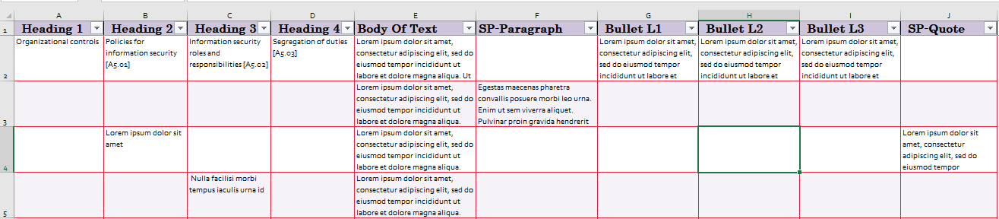
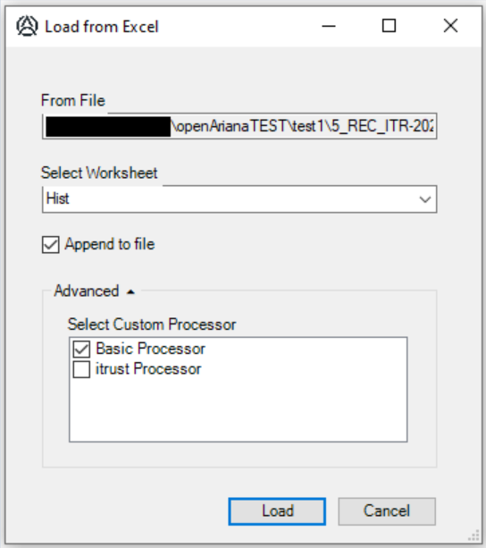
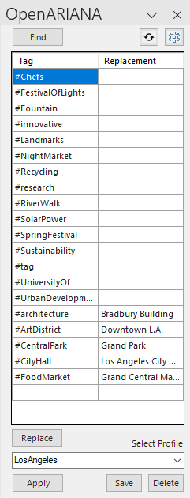
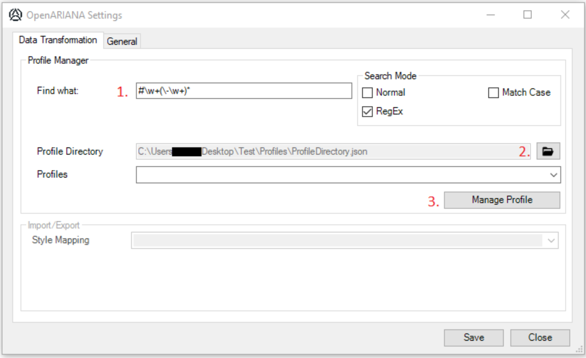

# Quick start

Welcome to OpenARIANA, a Microsoft Word Add-In designed to streamline your document creation process by reusing and repurposing standardized text. Here's how to get started:

1. Open any Word document.
2. Navigate to the OpenARIANA ribbon in the Word menu.

## Get & Transform Data

### Import

With OpenARIANA's Alpha version, you can load content from Excel files. Ensure the file is formatted as depicted below. Data loaded from an Excel file will adopt the styling defined in the respective column headers.

To import a file select the 'Load' icon in the OpenARIANA ribbon menu and select the Excel file to import from the file browser dialoge. 
This will forward you to the import dialoge shown below.

Select the worksheet you wish to import. Keep in mind that the worksheet MUST match the format shown above. 

The advanced setting allows you to select the processor used to parse the Excel and write to the active document. 
The Basic Processor is only able to process Excel worksheets as shown above, while the itrust Processor is also able to process itrust specific inline style syntax (see [here](./customsyntax.md)). 

An example document that was generated using the itrust processor from an Excel file is provided in ./docs/examples/. You can use the stored .docx file to verify that your OpenARIANA instance correctly processes itrust's style tags by loading the Excel file into the document and check that the generated data matches.

### Export

The Export method allows you to export the current document/selected page ranges/current selection to the custom OpenARIANA format to be stored in the standardized text database. 

__Status:__ The export feature is under development and not part of the Alpha version.

### Tag Replacement

Once you have opened or imported a standardised document you can open the 'OpenARIANA task pane' by selecting the 'Replace Tags' icon in the ribbon menu. 

Using the 'Find' button will search for the in the settings specified tag pattern within the document and list these in the table underneath as a tag-replacement pair. You can now provide replacements for each tag within the table and replace all using the 'Replace' button. If you wish to store the specified tag-replacement pairs to be reused for other documents, provide a name in the 'Select Profile' box and press the 'Save' button. 

Otherwise, if you already created profiles you can select a profile from the dropdown list and press 'Apply'. This will automatically match the applicable tag-value pairs within the document and list these in the tag-replacement table together with potentially missing tag-replacement pairs. 
If you complete the newly introduced pairs and wish to save these you can either create a new profile as outlined before or simply press 'Save'. This will update the selected profile with the changes.

For more info see [here](./profiles.md).

## Operational Modes

### Audit

- __Status:__ This feature is in the planning stage and not yet implemented in the Alpha version.

However, the current version has been used to generate audit reports based on text structure in a table as shown before. Audit reports using Tables and Conclusion summary are planned for a further release.

### Policy

- __Status:__ This feature is in the planning stage and not yet implemented in the Alpha version.

## Settings

In the Settings you'll be able to adjust the behaviour of OpenARIANA. 

### Profile Manager

1. Change the tag pattern. 
2. Change the profile directory. This will move all stored profiles to the new directory.
3. Manage selected profile in the dropdown list. Currently this will open the respective JSON file.

Changes will only apply after saving.

### Import/Export

- __Status:__ This feature is in the planning stage and not yet implemented in the Alpha version.

### General

In the General tab you can adjust the verbosity level of the Logger as well as open the log file for the current session.
